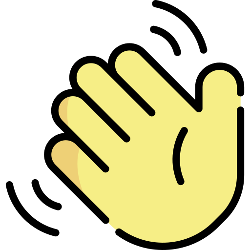

<h3 align="center">
  Fullstack Developer • Bot programmer for Discord • Coffee Lover
</h3>

   
  

<h2>About me</h2>
<li> Hello! My name is Fábio. I am a full-stack programmer with a thirst for acquiring new knowledge every day.
  <li> I have 3 years of experience with JavaScript and 1 year with TypeScript.
  <li> I have 2 years of experience building bots for Discord using the Discord.js library.
  <li> I always strive to respect people, coworkers, and seek practical solutions to complex problems.

<h3>My stack</h3>

 
<h3>Learning</h3>

<h2>Contact me</h2>

<strong>
  
 "Coffe fuels innovation" 

</strong>
